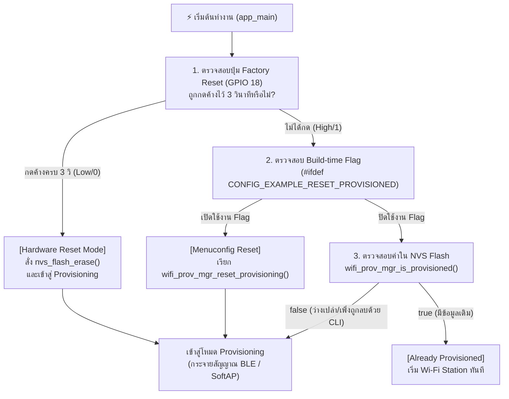

# ใบงานที่ 7.1  การศึกษากลไก Reset Provisioning 3 รูปแบบ และ NVS Memory Forensics

## 0. กล่าวนำ (Introduction)
เมื่ออุปกรณ์ ESP32 ผ่านการ Provisioning สำเร็จแล้ว ข้อมูล Wi-Fi จะถูกบันทึกไว้ใน NVS Flash Memory อย่างถาวร เมื่อเปิดเครื่องใหม่ เฟิร์มแวร์จะเข้าสู่สถานะ `Already provisioned` และข้ามขั้นตอนการรับข้อมูลใหม่ไปทันที

ในการพัฒนาผลิตภัณฑ์และการทดสอบความปลอดภัย วิศวกรจำเป็นต้องทราบวิธีการล้างค่าคอนฟิก (Factory Reset / Erase Credentials) ซึ่งในใบงานนี้นักศึกษาจะได้ทดลองและเปรียบเทียบกลไกการ Reset ครบทั้ง 3 รูปแบบ:
1. **Developer CLI Reset:** การล้างผ่านคำสั่ง Command Line บนเครื่องคอมพิวเตอร์
2. **Build-time Firmware Reset:** การกำหนดค่าผ่าน `menuconfig`
3. **Consumer Hardware Reset:** การต่อสวิตช์ปุ่มกดภายนอก (**External Pushbutton บน GPIO 18**) เพื่อใช้เป็นปุ่ม Factory Reset ทางกายภาพ เสมือนอุปกรณ์ IoT เชิงพาณิชย์จริง (หลีกเลี่ยงการใช้ปุ่ม BOOT/GPIO 0 ที่เป็น Strapping Pin)

---

## 1. วัตถุประสงค์ (Objectives)
1. ศึกษาและทำความเข้าใจสถานะ `Already provisioned` และการตัดสินใจของ `wifi_prov_mgr_is_provisioned()`
2. สามารถล้างข้อมูลการเชื่อมต่อใน Flash Memory ผ่านคำสั่ง CLI (`idf.py erase-flash` และ `esptool.py`) ได้
3. สามารถกำหนดค่า Build Configuration ใน `menuconfig` เพื่อสั่งรีเซ็ต State Machine ได้
4. เข้าใจข้อจำกัดของ **Strapping Pins (GPIO 0 / Bootloader Trap)** และสามารถต่อสวิตช์ปุ่มกดภายนอก (GPIO 18) เพื่อเขียนโปรแกรม Factory Reset ทางกายภาพได้อย่างถูกต้อง

---

## 2. อุปกรณ์ที่ใช้ในการทดลอง (Equipment)
1. บอร์ดไมโครคอนโทรลเลอร์ ESP32 พร้อมสาย USB
2. สวิตช์ปุ่มกด (Tactile Pushbutton Switch) จำนวน 1 ตัว พร้อมสายต่อ Breadboard
3. ESP-IDF Command Prompt (VS Code Terminal)

> [!IMPORTANT]
> **ทำไมจึงไม่ใช้ปุ่ม BOOT (GPIO 0) กดค้างตอนรีเซ็ตบอร์ด?**
> ขา **GPIO 0** บน ESP32 ทำหน้าที่เป็น **Strapping Pin** สำหรับเลือกโหมดการบูต หากขา GPIO 0 มีสถานะเป็น `LOW (0)` ในจังหวะที่บอร์ดถูกรีเซ็ตหรือจ่ายไฟ ชิป ESP32 จะเข้าสู่โหมด **ROM Download Bootloader** (`waiting for download`) ทันที ทำให้ตัวประมวลผลหยุดรอการแฟลชโปรแกรมและไม่รันโค้ด `app_main()` 
> 
> ดังนั้น ในการออกแบบอุปกรณ์เชิงพาณิชย์ จึงนิยมใช้ขา GPIO ทั่วไป (เช่น **GPIO 18**) ต่อร่วมกับปุ่มกดภายนอกเพื่อทำ Factory Reset แทน

---

## 3. สถาปัตยกรรมและการต่อวงจร (Hardware Wiring & Flow)

### 3.1 การต่อวงจรปุ่มกด Factory Reset (GPIO 18)
- ขาหนึ่งของสวิตช์ปุ่มกด $\rightarrow$ ต่อเข้าขา **GPIO 18** ของ ESP32
- อีกขาหนึ่งของสวิตช์ $\rightarrow$ ต่อลง **GND**
*(เปิดใช้งาน Internal Pull-up Resistor ในโค้ด จึงไม่ต้องต่อตัวต้านทานภายนอกเพิ่ม)*



---

## 4. ขั้นตอนการทดลอง (Step-by-Step Procedures)

### ตอนที่ 1 การล้าง Flash ผ่าน Command Line (Developer Level)
1. เสียบสาย USB เข้ากับคอมพิวเตอร์ ตรวจสอบหมายเลขพอร์ต COM (เช่น `COM24`)
2. เปิด Terminal ในโฟลเดอร์โปรเจกต์ `Week-07-W-iFi-Privisioning/Example_codes/Lab7-1-Reset-and-NVS-Forensics`
3. สั่งล้าง Flash Memory ทั้งหมดของชิปด้วยคำสั่ง:
   ```powershell
   idf.py -p COM24 erase-flash
   ```
4. ทำการ Flash โปรแกรมและเปิด Serial Monitor:
   ```powershell
   idf.py -p COM24 flash monitor
   ```
5. สังเกต Log ว่า ESP32 จะรายงานสถานะ `"Starting provisioning"` และสร้าง QR Code ขึ้นมาบนหน้าจอ

---

### ตอนที่ 2 การบังคับ Reset ผ่าน Menuconfig (Firmware Configuration Level)
1. กดปุ่ม `Ctrl + ]` เพื่อออกจาก Serial Monitor
2. เปิดหน้าต่างคอนฟิกโปรเจกต์:
   ```powershell
   idf.py menuconfig
   ```
3. ใช้ปุ่มลูกศรเลื่อนไปที่หัวข้อ **Example Configuration**
4. เลื่อนไปที่บรรทัด **`Reset Provisioned state (Erase credentials)`** แล้วกดปุ่ม `Spacebar` เพื่อเลือกให้มีเครื่องหมาย `[*]`
5. กดปุ่ม `S` เพื่อบันทึก และ `Q` เพื่อออกจากเมนู
6. สั่ง Build และ Flash โปรแกรม:
   ```powershell
   idf.py -p COM24 flash monitor
   ```
7. สังเกตผลลัพธ์ใน Log: บอร์ดจะทำการล้าง Credentials เก่าทิ้งทุกครั้งที่เปิดเครื่องใหม่

---

### ตอนที่ 3 การสร้างปุ่ม Factory Reset ด้วยฮาร์ดแวร์ภายนอก (GPIO 18)

1. นำสวิตช์ปุ่มกดต่อเข้ากับขา **GPIO 18** และ **GND**
2. เพิ่มฟังก์ชันตรวจสอบปุ่ม Factory Reset ลงในไฟล์ `main/main.c`:

```c
#include "driver/gpio.h"

#define FACTORY_RESET_BUTTON_GPIO  GPIO_NUM_18   // ปุ่ม Factory Reset ภายนอก (ต่อลง GND)

static bool check_factory_reset_button(void)
{
    // กำหนดค่า GPIO 18 เป็น Input พร้อมเปิด Internal Pull-up Resistor
    gpio_config_t io_conf = {
        .pin_bit_mask = (1ULL << FACTORY_RESET_BUTTON_GPIO),
        .mode = GPIO_MODE_INPUT,
        .pull_up_en = GPIO_PULLUP_ENABLE,
        .pull_down_en = GPIO_PULLDOWN_DISABLE,
        .intr_type = GPIO_INTR_DISABLE,
    };
    gpio_config(&io_conf);

    ESP_LOGI("FACTORY_RESET", "Hold GPIO 18 button for 3 seconds to trigger Factory Reset...");
    
    // ตรวจสอบสถานะปุ่มกดค้าง (Active Low / Logic 0)
    int hold_count = 0;
    while (gpio_get_level(FACTORY_RESET_BUTTON_GPIO) == 0) {
        vTaskDelay(pdMS_TO_TICKS(100));
        hold_count++;
        if (hold_count % 10 == 0) {
            ESP_LOGI("FACTORY_RESET", "Holding button... %d/3 seconds", hold_count / 10);
        }
        if (hold_count >= 30) { // กดค้างครบ 3 วินาที (30 x 100ms)
            ESP_LOGW("FACTORY_RESET", "=================================================");
            ESP_LOGW("FACTORY_RESET", ">>> FACTORY RESET TRIGGERED! ERASING NVS FLASH <<<");
            ESP_LOGW("FACTORY_RESET", "=================================================");
            return true;
        }
    }
    return false;
}
```

3. เรียกใช้งานในตอนเริ่มต้นของฟังก์ชัน `app_main()`:

```c
void app_main(void)
{
    // ตรวจสอบการกดปุ่ม Factory Reset ทางกายภาพ (GPIO 18)
    if (check_factory_reset_button()) {
        ESP_ERROR_CHECK(nvs_flash_erase());
    }

    /* Initialize NVS partition */
    esp_err_t ret = nvs_flash_init();
    if (ret == ESP_ERR_NVS_NO_FREE_PAGES || ret == ESP_ERR_NVS_NEW_VERSION_FOUND) {
        ESP_ERROR_CHECK(nvs_flash_erase());
        ESP_ERROR_CHECK(nvs_flash_init());
    }
    // ... โค้ดเดิมต่อจากนี้ ...
```

#### การทดสอบ:
1. ปล่อยให้บอร์ดทำงานปกติ $\rightarrow$ บอร์ดจะจำค่าเดิมได้ (`Already provisioned`)
2. กดปุ่มที่ต่อกับ **GPIO 18 ค้างไว้ 3 วินาที** จากนั้นกดรีเซ็ตบอร์ด หรือกดค้างขณะเปิดเครื่อง
3. สังเกต Serial Monitor: ระบบจะตรวจพบการกดค้าง 3 วินาที และสั่งล้าง NVS Flash เพื่อกลับสู่โหมด Provisioning ทันที!

---

---

## 5. กิจกรรมถอดรหัสซอร์สโค้ดและเขียนผังงาน (Code Deconstruction & Flowchart Assignment)

ให้นักศึกษาศึกษาโค้ดใน `main/main.c` และ `main/led_indicator.c` แล้วเขียน **ผังงาน (Flowchart / State Diagram)** เพื่ออธิบายการตัดสินใจและการทำงานของระบบ:

### ภารกิจที่ 1  ผังงานการตัดสินใจช่วง Bootstrapping & Reset Decision
ให้นักศึกษาวาด Flowchart แสดงลำดับตรรกะการตรวจสอบเงื่อนไขตั้งแต่เริ่มต้นรันฟังก์ชัน `app_main()` โดยต้องครอบคลุม:
1. การตรวจสอบสถานะปุ่ม **GPIO 18** (ตรวจจับการกดค้าง 3 วินาที)
2. การทำงานของ `nvs_flash_init()` และกรณีที่ต้อง `nvs_flash_erase()`
3. การตรวจสอบ Macro `#ifdef CONFIG_EXAMPLE_RESET_PROVISIONED`
4. การเรียกฟังก์ชัน `wifi_prov_mgr_is_provisioned(&provisioned)`
5. จุดแยกสายการทำงานเข้าสู่โหมด **Provisioning Mode** หรือ **Station Mode**


### ภารกิจที่ 2 ผังสถานะการเปลี่ยนจังหวะไฟ LED 1 (Wi-Fi STA Indicator)
ให้นักศึกษาวาด State Diagram แสดงการเปลี่ยนสถานะของ **LED 1 (GPIO 2)**:
- เงื่อนไขใดทำให้ LED 1 เข้าสู่สถานะ `LED_STA_MODE_DISCONNECTED` (กระพริบ 200ms Mark / 200ms Space)
- เงื่อนไขหรือ Event ใดทำให้เปลี่ยนเป็น `LED_STA_MODE_CONNECTED` (Heartbeat 200ms ทุก 1s)


---

## 6. ตารางบันทึกผลการทดลอง (Experiment Results)
 
| รูปแบบการ Reset | คำสั่ง / พฤติกรรมที่ทำ | พฤติกรรมของ LED แต่ละดวงหลังเปิดเครื่อง | สถานะใน Serial Monitor |
| :--- | :--- | :--- | :--- |
| **1. CLI Erase** | `idf.py erase-flash` | LED ดับ ไม่ติดเลย | <pre>I (312) LAB7_1_RESET: Hold GPIO 18 button for 3 seconds to trigger Factory Reset...<br>I (322) wifi:wifi driver task: 3ffc1a5c, prio:23, stack:6656<br>W (398) LAB7_1_RESET: --------------------------------------------------<br>W (398) LAB7_1_RESET: [STATUS]: Device is NOT provisioned (NVS is empty)<br>W (408) LAB7_1_RESET: Ready for Provisioning Lab 7-2 (SoftAP) or 7-3 (BLE)!<br>W (418) LAB7_1_RESET: --------------------------------------------------</pre> |
| **2. Menuconfig Flag** | `CONFIG_EXAMPLE_RESET_PROVISIONED=y` | กระพริบถี่ ๆ | <pre>I (313) LAB7_1_RESET: Hold GPIO 18 button for 3 seconds to trigger Factory Reset...<br>I (399) LAB7_1_RESET: --------------------------------------------------<br>I (399) LAB7_1_RESET: [STATUS]: Already provisioned! Starting Wi-Fi Station<br>I (409) LAB7_1_RESET: --------------------------------------------------<br>I (529) wifi:mode : sta (3c:61:05:12:ab:cd)<br>I (2189) esp_netif_handlers: sta ip: 192.168.1.42, mask: 255.255.255.0, gw: 192.168.1.1<br>I (2189) LAB7_1_RESET: =================================================<br>I (2189) LAB7_1_RESET: [ONLINE]: Connected with IP: 192.168.1.42<br>I (2199) LAB7_1_RESET: =================================================</pre> |
| **3. Hardware Button (GPIO 18)** | กดปุ่ม GPIO 18 ค้าง 3 วินาที | LED ดับ ไม่ติดเลย | <pre>I (311) LAB7_1_RESET: Hold GPIO 18 button for 3 seconds to trigger Factory Reset...<br>I (1311) LAB7_1_RESET: Holding button... 1/3 seconds<br>I (2311) LAB7_1_RESET: Holding button... 2/3 seconds<br>I (3311) LAB7_1_RESET: Holding button... 3/3 seconds<br>W (3311) LAB7_1_RESET: =================================================<br>W (3311) LAB7_1_RESET: &gt;&gt;&gt; FACTORY RESET TRIGGERED! ERASING NVS FLASH &lt;&lt;&lt;<br>W (3321) LAB7_1_RESET: =================================================<br>W (3331) LAB7_1_RESET: [FORENSIC]: User requested Flash Erase!<br>W (3491) LAB7_1_RESET: --------------------------------------------------<br>W (3491) LAB7_1_RESET: [STATUS]: Device is NOT provisioned (NVS is empty)<br>W (3501) LAB7_1_RESET: Ready for Provisioning Lab 7-2 (SoftAP) or 7-3 (BLE)!<br>W (3511) LAB7_1_RESET: --------------------------------------------------</pre> |

---

## 7. คำถามท้ายการทดลอง (Post-Lab Questions)
1. เพราะเหตุใดการกดปุ่ม BOOT (GPIO 0) ค้างไว้ในจังหวะรีเซ็ตบอร์ด จึงทำให้โปรแกรมค้างอยู่ที่ ROM Bootloader และไม่ยอมทำงานต่อ?
```
GPIO 0 เป็น Strapping Pin ที่ชิปใช้เลือกโหมดบูต ชิป ESP32 จะแลตช์ค่าลอจิกของขานี้  ทีขอบขาขึ้นของสัญญาณ reset  ถ้าตอนนั้นเป็น LOW (0)  ROM code จะตัดสินใจเข้าสู่ ROM Download Bootloader แทนที่จะไปโหลด Second-stage bootloader ทำให Application จาก flash ผลคือ CPU หยุดรออยู่ที่สถานะ waiting for download บน UART ไม่มีการเรียก app_main() เลย ต่อให้ปล่อยปุ่มทีหลังก็ไม่ช่วย เพราะการตัดสินใจเกิดไปแล้วตอน reset ต้องกด EN ใหม่โดยไม่กด BOOT 
```
2. เพราะเหตุใดคำสั่ง `idf.py erase-flash` จึงทำให้ข้อมูลเฟิร์มแวร์ Application หายไปด้วย ในขณะที่ `nvs_flash_erase()` ไม่ทำให้เฟิร์มแวร์หาย?
```
    - idf.py erase-flash เป็นคำสั่งฝั่ง PC ที่คุยกับ ROM bootloader ผ่าน esptool สั่ง Chip Erase ทั้งชิป โดยไม่สนใจ Partition Table เลย ทุก sector ถูกเขียนเป็น 0xFF หมด ทั้ง bootloader, partition table, factory , nvs, phy_init จึงต้อง flash ใหม่ทั้งหมด
    - nvs_flash_erase() เป็นฟังก์ชันที่รันอยู่บนเฟิร์มแวร์เอง มันอ่าน Partition Table แล้วลบเฉพาะ sector ที่อยู่ในพาร์ทิชันชนิด data/nvs ซึ่งเป็นที่เก็บ Wi-Fi credentials เท่านั้น พาร์ทิชัน factory ที่เก็บโค้ดแอปไม่ถูกแตะ 
```
3. การออกแบบปุ่ม Factory Reset บนอุปกรณ์ IoT เชิงพาณิชย์ เหตุใดจึงต้องกำหนดให้ผู้ใช้กดปุ่มค้างไว้ 3-5 วินาที แทนที่จะสั่งลบข้อมูลทันทีที่แตะปุ่มเพียงเสี้ยววินาที?
```
เพราะ Factory Reset เป็นการกระทำที่ กู้คืนไม่ได้ ข้อมูลที่หายคือ credentials ที่ผู้ใช้ต้องเดินกลับไปทำ provisioning ใหม่ทั้งกระบวนการ การกดค้างจึงทำหน้าที่เป็น การยืนยันสิงที่อยากทำจริงๆ ป้องกัน 3 อย่างต่อไปนี้
    1. การกดโดนโดยบังเอิญ ปุ่มถูกชน กดทับตอนขนย้าย หรือเด็กเผลอกด
    2. สัญญาณรบกวนทางไฟฟ้า  ปุ่มจริงมีการเด้ง ระดับมิลลิวินาที ถ้าลบทันทีที่เห็น LOW ครั้งแรก noise หรือไฟกระชากอาจทริกเกอร์เองได้ การนับต่อเนื่อง 30 รอบ × 100ms อย่างในโค้ดจึงทำหน้าที่ debounce ในตัว
    3. ให้โอกาสยกเลิก  ระหว่างกดค้าง เฟิร์มแวร์รายงาน Holding button... 1/3 seconds และมักกระพริบไฟเตือน ผู้ใช้ที่กดผิดปล่อยมือได้ทัน โดยไม่มีอะไรถูกลบ
```
4. หากอุปกรณ์ IoT ถูกติดตั้งอยู่บนเสาสูงหรือฝังอยู่ในผนัง วิธีการ Reset ทางกายภาพรูปแบบใดเหมาะสมที่สุด?
```
    ใช้แหล่งจ่ายไฟ โดยออกแบบเป็น Power-Cycle Reset  คือให้เฟิร์มแวร์นับจำนวนครั้งที่ถูกตัด-ต่อไฟติดต่อกันอย่างรวดเร็ว เก็บ counter ไว้ใน NVS หรือ RTC memory ถ้าครบตามกำหนด เช่น เปิด-ปิดเบรกเกอร์ 5 ครั้งติดภายใน 10 วินาที จึงสั่ง nvs_flash_erase() แล้วกลับเข้าโหมด Provisioning ส่วนถ้าบูตแล้วอยู่นานเกิน 10 วินาทีก็รีเซ็ต counter กลับเป็นศูนย์ ถือว่าเป็นการเปิดใช้งานปกติ
```
